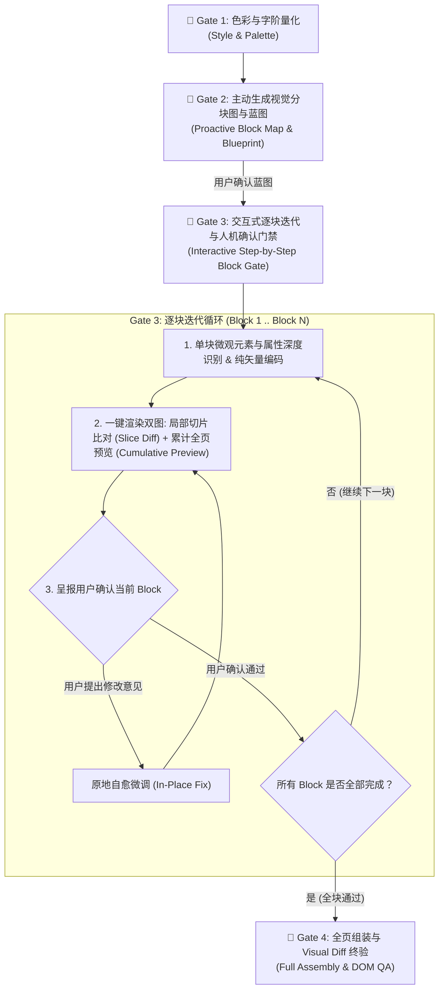

# AGENTS.md: PPT Restoration Standard Operating Procedure (SOP)

> **For AI Coding Agents (Claude Code, Cursor, Aider, Antigravity, OpenClaw, Codex)**
> When you are tasked with reconstructing a PPT image/screenshot or PDF into an editable `.pptx` file in this repository, **you MUST follow this strict Block-by-Block Interactive Design SOP and pass all 4 Quality Gates.**

---

## 🎯 核心交互与设计原则 (Core Principles)

1. **逐块实现与交互式用户确认 (Interactive Block-by-Block Execution & Checkpoint)**:
   - **主动分块标记先行 (Proactive Block Map)**：在进入代码实现前，**Agent 必须主动生成「视觉分块全景图 (block_map)」并输出「结构化分块蓝图表格」**（明确 Block 划分、0-1000 坐标、关键组件、配色与字阶），主动呈报给用户对齐确认。
   - **逐块实现与双图呈报 (Per-Block Implementation & Dual Preview Delivery)**：严禁一次性盲目全量编码所有 Block！必须逐块实现（Block 1..N），每完成一个 Block 必须生成**「局部切片比对图 (Slice Diff)」+「截至当前 Block 的累计全页预览图 (Cumulative Preview)」**供用户审核。
   - **严格原地阻塞自愈 (Strict In-Place Healing Loop)**：若用户对当前 Block 提出微调或修改意见，**必须在当前 Block 中就地微调修复并重新出图复验**，直到用户明确确认“通过/无误”，才允许进入下一个 Block。
   - **单脚本模块化函数解耦**：代码必须按区块拆分为独立的 Block 函数（如 `add_header_section`, `add_kpi_section`, `add_clipboard_table_section`, `add_strategy_card_section`），支持独立传参调试（`--blocks`）、累加构建（`--cumulative-up-to`）与全页组装。

2. **100% 纯原生矢量渲染架构 (100% Pure Native Vector Architecture - Zero Images)**:
   - **严禁暴力降维**：严禁将 3D 透视艺术/拟物板夹/复合卡片暴力降维为简陋的 2D 平面大色块！
   - **自由多边形与立体几何拼装 (Freeform Geometric Assembly)**：当幻灯片包含 3D 透视书本/文件夹、拟物板夹、立体顶板厚度时，使用 `builder.add_polygon(...)` 精确拼装 3D 倾斜顶板、正面开页、侧边厚度、投影与活页装订环。
   - **拟物展示板与表格 (Layered Clipboard & Native Table)**：使用层叠底板（梯度蓝底板 + 金属挂件 + 内衬白纸）拼装拟物板夹，表格使用 `builder.add_table(...)` 配合 `row_bg_colors` 渲染斑马纹与发光珍珠滑块进度条。
   - **原生艺术文本与光球组合**：针对毛笔大字（如“破局”）、3D 渐变光球等艺术元素，采用 PPT 原生艺术文本框 + 原生正圆渐变球体 + 矢量速度线进行拼装，确保全页面 100% 可在 PPT 中任意双击改字、调色与缩放。
   - **100% 原生可编辑业务层**：所有业务卡片容器、复合 KPI 卡片、药丸标签、正文、数字指标（如 38万, 6.1%, 84% 等）**必须 100% 采用 PPT 原生文本框与矢量形状（PICTURE 计数恒为 0）**。

3. **Normalized 0-1000 Coordinate System**:
   - 所有空间坐标统一归一化为 `0-1000`（`[left, top, width, height]`）。
   - `left: 0` 为左边缘，`left: 1000` 为右边缘；`top: 0` 为顶边缘，`top: 1000` 为底边缘。

---

## 🚪 交互式 4 大质量门禁 (The 4 Interactive Quality Gates)

### 🔹 Gate 1: Style & Palette Gate (非多模态色彩与字阶自动化量化)
使用确定性工具链探测设计规范，**严禁多模态肉眼臆测**：
- **运行取色工具**：`python tools/color_profiler.py input/<name>.png --box L T W H`
  - 自动输出精确主色（Top-5 K-Means HEX）
  - 自动输出水平/垂直渐变方向及两端起止色
  - 自动输出边框色与粗细
- **Y 轴背景色阶突变探测 (防脑补嵌套大卡)**：
  - 自动解析 `sub_containers` 输出：高度 $\le 55\text{px}$ 且下方为纯白的区域必须使用 `title_strip`（条形标题底板），正文列表必须直接坐落于纯白大卡表面（`plain_text_area`），严禁脑补包裹正文的巨大底卡！
- **字阶梯度与行高**：
  - 主标题：`32 - 36pt` (Bold)
  - 核心指标大字：`20 - 24pt` (Bold)
  - 板块/卡片标题：`14 - 16pt` (Bold)
  - 正文/项目列表：`10 - 11.5pt` (Regular/Medium, 单行设置 `word_wrap=False`)
  - 胶囊/药丸标签：`8.5 - 10pt` (Bold)

### 🔹 Gate 2: Proactive Macro Blueprint Gate (主动分块图与蓝图门禁)
**必须主动运行**：`python tools/segment.py input/<name>.png --scaffold`，并在回复中直接展示分块图与结构化表格，**等待用户对整体分块架构进行确认**：
1. **展示分块图**：内嵌 `output/block_map_<name>.png`
2. **输出分块蓝图表格**：
| 编号 | 区块名称 (Block Name) | 0-1000 坐标范围 `[L, T, W, H]` | 核心组件与视觉手法 | 对应函数 |
| :--- | :--- | :--- | :--- | :--- |
| **Block 1** | 顶部主标题区 (Header) | `[35, 38, 930, 55]` | 原生大字标题 + 优雅全宽分割线 + 作者标识 | `add_header_section` |
| **Block 2** | 总结概览横幅 (Summary) | `[35, 108, 930, 75]` | 浅蓝质感底卡 + 渐变深蓝徽章 + 结构化指标富文本 | `add_summary_banner_section` |
| **Block 3** | 效能透视与 KPI 组 (KPI) | `[35, 192, 930, 110]` | 导言文案 + 3 联外凸标签复合卡片 + 渐变指示箭头 | `add_mid_kpi_section` |
| **Block 4** | 拟物战役板夹 (Clipboard) | `[35, 325, 435, 600]` | 双层蓝底金属板夹 + 原生表格斑马纹 + 5 组珍珠滑块进度条 | `add_clipboard_table_section` |
| **Block 5** | 战略行动大卡 (Strategy) | `[485, 325, 480, 600]` | 渐变蓝顶栏 + 2 组行动白卡 + 底部关键词药丸阵列 | `add_strategy_card_section` |

---

### 🔹 Gate 3: Interactive Step-by-Step Block Gate (交互式逐块迭代与人机确认门禁)
进入代码开发后，**Agent 必须严格按 Block 1 到 Block N 顺序单块流转**：

1. **单块微观元素与属性识别**：
   - 提取该 Block 内所有容器、卡片、表格、文本、字体大小、HEX 颜色、渐变角度与边框。
   - 在 `slides/build_<name>.py` 编写对应的纯矢量函数（如 `add_header_section`）。
2. **生成单块交付物（双图）**：
   - 构建累计 PPTX：`python slides/build_<name>.py --cumulative-up-to <idx> -o output/<name>_step_<idx>.pptx`
   - 一键生成双图：`python tools/render_and_diff.py output/<name>_step_<idx>.pptx input/<name>.png -o output/diff_block_<idx>.png --crop-box L T W H --block-title "<Block Name>" --cumulative-out output/preview_cumulative_<idx>.png`
3. **呈报用户审核**：
   - 向用户展示：**「局部切片比对图 (Slice Diff)」** + **「截至当前 Block 的累计全页预览图 (Cumulative Preview)」**。
   - 详细列出当前 Block 的属性量化信息（坐标、字体大小、HEX 颜色）。
   - **请求用户确认当前 Block 是否满意**。
4. **原地阻塞自愈机制 (Strict In-Place Healing Loop)**：
   - ⚠️ **若用户提出修改意见**：立即在当前 Block 函数中微调修正，重新生成双图并再次呈报用户，**严禁跳过未确认的 Block 直接做后续内容**！
   - ✅ **若用户确认通过**：进入下一个 Block（Block i+1）。

---

### 🔹 Gate 4: Visual Diff QA Gate (全页终验与 DOM 检查门禁)
所有 Block 逐一通过用户确认后，进行全页最后收官闭环：
1. **全页组装构建**：`python slides/build_<name>.py -o output/<name>.pptx`
2. **DOM 结构终检**：运行 `python tools/inspect_pptx.py output/<name>.pptx`（检查 `PICTURE` 计数恒为 0）
3. **全页 Visual Diff 交付**：运行 `python tools/render_and_diff.py output/<name>.pptx input/<name>.png -o output/diff_<name>.png`，向用户交付最终 PPTX 与全页对比成果。

---

## 📚 详细 API 与组件代码速查

完整的 `SlideBuilder` API 文档、0-1000 坐标系组件定义与 CLI 工具用法，请查阅：
👉 [**`docs/API_REFERENCE.md`**](file:///Users/feng.liu/workspace/docs/API_REFERENCE.md)
