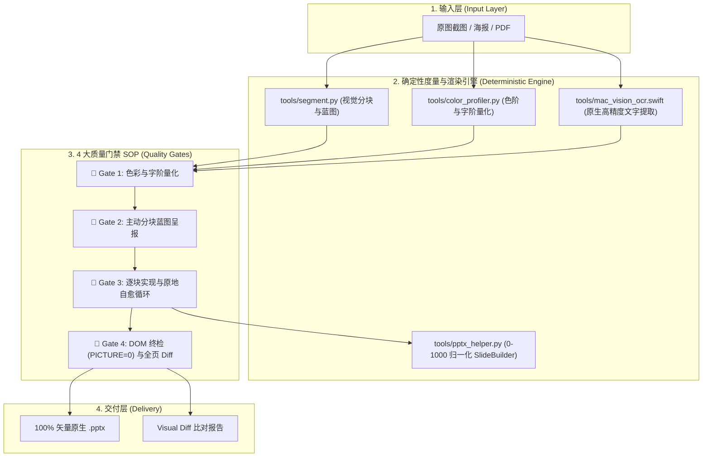

# PPT Restoration 系统架构与工程体系

本项目是一套面向 AI Coding Agent 的工程化 PPT 还原系统。核心目标是将图片、海报或 PDF 页面转化为 **100% 原生可二次编辑、兼具 3D 拟态质感与数据可视化** 的 PowerPoint（`.pptx`）文件。

---

## 🏗️ 1. 核心架构分层

---

## 🎯 2. 核心设计原则

### 2.1 0-1000 归一化坐标系 (Normalized Coordinates)
为了彻底摆脱物理像素/磅值计算与不同分辨率屏幕的换算偏差，全系统统一采用 `0-1000` 归一化空间坐标：
* `left: 0` 为最左，`left: 1000` 为最右；`top: 0` 为顶部，`top: 1000` 为底部。
* 任何局部容器或卡片均能以绝对或相对比例自适应布局。

### 2.2 100% 纯原生矢量渲染 (Zero Image Degradation)
* **业务元素绝对原生**：所有业务卡片容器、复合 KPI 卡片、药丸标签、文本、表格和数字指标必须 100% 采用 PPT 原生文本框与矢量形状。
* **DOM 严格校验**：在 Gate 4 执行 DOM 检查，确保生成的 PPT 中 `PICTURE` 计数恒为 0，保证用户可在 PowerPoint 中任意双击改字、调色与缩放。

---

## 🤖 3. Multi-Agent 演进架构设计

当前系统从单 Agent 串行向分工解耦的 **Subagent 协作网络** 演进：

1. **`Architect Agent` (架构与规划)**：
   - 负责 Gate 1 与 Gate 2。
   - 调用确定性工具（`segment.py`、`color_profiler.py`），生成宏观分块蓝图与 Spec，与人类用户完成一次性蓝图对齐。
2. **`Developer Agent` (单块代码生成)**：
   - 接收单个 Block 的规范与 API 定义，在纯净的上下文窗口中编写 Python 矢量构建代码。
3. **`Reviewer Agent` (视觉 Diff 自动化质检)**：
   - 基于 `render_and_diff.py` 自动比对局部与全局渲染效果，提供像素偏移与样式修正意见，驱动自愈循环，承担 80% 的日常验货工作，仅在严重冲突时上报人类。
