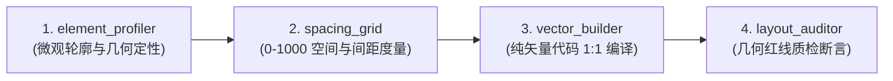

# PPT Restoration Skill Pipeline Specification

> **标准 Skill 体系**：将幻灯片高保真纯矢量还原拆解为 4 大标准化、机器可校验的执行管线。

---

## 🧭 Skill 架构全景

| Skill 目录 | 对应工件与核心输出 | 执行命令 |
| :--- | :--- | :--- |
| **`skills/element_profiler/`** | 轮廓圆度分类器（正圆/胶囊/矩形）、HEX 色阶 | `python -m skills.element_profiler.profiler <roi.png>` |
| **`skills/spacing_grid/`** | 0-1000 坐标系、栅格网格矩阵、双栏基准线计算 | `python -m skills.spacing_grid.grid_calculator --columns-baseline` |
| **`skills/vector_builder/`** | 从 `manifest.json` 自动编译纯矢量 Python 代码 | `python -m skills.vector_builder.code_generator <manifest.json>` |
| **`skills/layout_auditor/`** | 双栏顶底对齐、底部留白、字阶与 DOM 红线断言 | `python -m skills.layout_auditor.auditor <deck.pptx>` |
