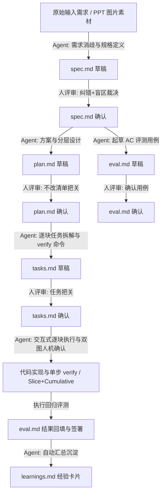

# SDD (Spec-Driven Development) 开发规范指南

本项目严格遵循 **规范驱动开发（SDD, Spec-Driven Development）** 流程。任何 PPT 还原或功能开发任务，均由 AI Coding Agent 依照五份规范文档闭环执行：

---

## 📋 五大规范文档职责与约束

1. **`spec.md`（需求规格说明书）**
   - 职责：说明*做成什么样*（消歧、3D底图与原生图层边界、US 验收标准、盲区裁决表）。
   - 严禁：写具体的代码架构与实现细节（那是 plan.md 的职责）。

2. **`plan.md`（技术架构与方案设计）**
   - 职责：说明*怎么做*（4层渲染流水线、模块化 Block 蓝图设计、降级容错、**“不改清单”硬约束**）。
   - 严禁：违反不改清单中的底线规则（如禁止文字贴图、坐标系 0-1000 规范）。

3. **`tasks.md`（任务拆解清单）**
   - 职责：说明*执行顺序与自证方式*（T-01 基础设施 ➔ T-02~T-05 **逐块 Block 实现与人机确认** ➔ T-06 全页回归终验）。
   - **交互式硬性约束**：每一个 Block 任务必须有明确可执行的 `verify 命令`（构建阶段 PPTX + 一键生成切片对比图与累计预览图），呈报用户确认并完成原地自愈后方可打勾 `[x]`！

4. **`eval.md`（验收评测矩阵）**
   - 职责：说明*判定标准与结果*（逐条核对 US 验收标准、降级自检、DOM 树检查、签署 `verdict_by`）。

5. **`learnings.md`（复盘与经验沉淀）**
   - 职责：自动提炼每次迭代的认知升级（L-01~L-04，问题/根因/修复/可复用性）。

---

## 🗂️ 目录与文件归档约定

- 规范模板存放在 `specs/templates/`；
- 当前迭代产物归档在 `specs/current/`（同时在根目录保留同名镜像以便审查）；
- Agent 引导 Prompt 存放在 `agent/prompts/`。
