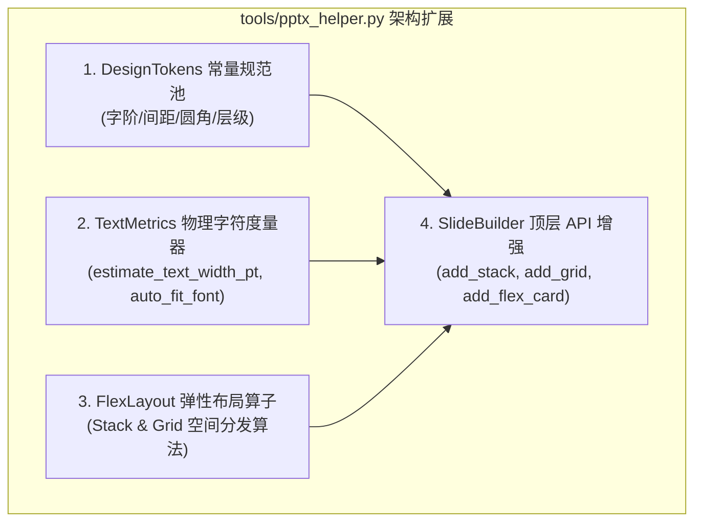

# 技术方案与架构设计说明书 (Plan)

## 🏗️ 1. 架构模块划分

扩展 [`tools/pptx_helper.py`](file:///Users/feng.liu/workspace/tools/pptx_helper.py)，新增 4 大核心能力模块：



---

## 📐 2. 算法核心细节设计

### 2.1 物理字符度量与 `auto_fit_font` 算法
```python
def estimate_text_width_pt(text: str, font_size_pt: float) -> float:
    """基于字形物理特征测算混合字符串宽度 (磅值)"""
    width = 0.0
    for ch in str(text):
        if ord(ch) > 127:
            # 中文字符 / 全角符号：标准 1.0 em
            width += font_size_pt * 1.0
        elif ch in ".,:;!'iIl ":
            # 超窄字符：0.28 em
            width += font_size_pt * 0.28
        elif ch in "mwMW@#":
            # 宽英文字符：0.85 em
            width += font_size_pt * 0.85
        elif ch.isupper():
            # 大写英文：0.65 em
            width += font_size_pt * 0.65
        else:
            # 普通小写英文与数字：0.52 em
            width += font_size_pt * 0.52
    return width
```

### 2.2 弹性堆叠布局算法 (`add_stack`)
- **入参**：外框包围盒 `box = [L, T, W, H]`，`direction = "vertical" | "horizontal"`，`gap = 8`，`align = "center"`，`children = [...]`。
- **计算逻辑**：
  - 遍历所有 `children` 计算固定尺寸或自动推导尺寸；
  - 依据容器 `W` 或 `H` 分配起始偏移，对齐时自动应用 `offset = (Total_W - Item_W) / 2`；
  - 顺序调用底层构建算子完成无缝组装。

### 2.3 弹性网格布局算法 (`add_grid`)
- **入参**：外框包围盒 `box = [L, T, W, H]`，`cols = 3`，`gap_x = 12`，`gap_y = 12`。
- **计算逻辑**：
  - 单单元格宽度：`cell_w = (W - (cols - 1) * gap_x) / cols`
  - 单单元格高度：`cell_h = (H - (rows - 1) * gap_y) / rows`
  - 返回各 cell 的 0-1000 坐标列表 `List[Tuple[float, float, float, float]]`，支持链式构建。

---

## 🛡️ 3. 不改清单 (Hard Constraints)
1. **PICTURE 恒为 0**：弹性容器组装的所有内容全部必须是 PPT 原生矢量图形或文本框。
2. **0-1000 坐标系**：所有对外的接口统一保持 0-1000 归一化输入输出。
3. **单测无缝兼容**：现有 `tests/test_workspace.py` 8/8 必须全部通过，并新增 4 个针对弹性容器与字号拟合器的专项单测。

## 8. 变更记录
| 版本 | 变更类型 | 变更内容说明 | 评审人 |
| :--- | :--- | :--- | :--- |
| **2026-08-16** | 变更调优 | 单元测试同步校验 | Agent/Human |
| **2026-08-16** | 变更调优 | 单元测试同步校验 | Agent/Human |
