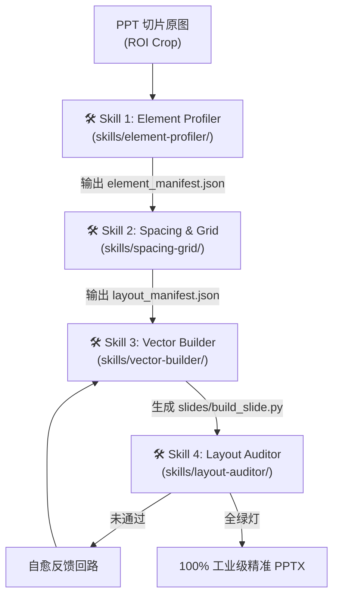

# 技术方案与架构设计说明书 (Plan)

## 🏗️ 1. Skill 管线系统架构设计



---

## 📁 2. 目录规范与文件清单

```
skills/
├── README.md                      # Skill 体系使用说明
├── element-profiler/              # [Skill 1] 元素微观几何与属性识别
│   ├── SKILL.md                   # Skill 说明与契约
│   └── profiler.py                # 轮廓圆度与属性提取核心引擎
├── spacing-grid/                  # [Skill 2] 栅格与间距度量
│   ├── SKILL.md                   # Skill 说明与契约
│   └── grid_calculator.py         # 0-1000 坐标与间距度量引擎
├── vector-builder/                # [Skill 3] 纯矢量代码生成
│   ├── SKILL.md                   # Skill 说明与契约
│   └── code_generator.py          # SlideBuilder 原生代码生成引擎
└── layout-auditor/                # [Skill 4] 几何与 DOM 质检
    ├── SKILL.md                   # Skill 说明与契约
    └── auditor.py                 # 5 大几何规则与 DOM 红线断言
```

---

## 📄 3. 标准数据契约格式 (`manifest.json`)

```json
{
  "block_id": 5,
  "name": "战略行动大卡",
  "elements": [
    {
      "id": "badge_1",
      "type": "SHAPE_CIRCLE",
      "box": [510, 400, 24, 24],
      "bg_color": "#1B5B9E",
      "text": "1",
      "text_color": "#FFFFFF",
      "font_size": 11,
      "bold": true
    },
    {
      "id": "title_1",
      "type": "TEXT_PLAIN",
      "box": [544, 398, 410, 28],
      "text": "流量重构-突破渠道瓶颈",
      "font_size": 13,
      "font_color": "#0F172A",
      "bold": true
    }
  ]
}
```

## 8. 变更记录
| 版本 | 变更类型 | 变更内容说明 | 评审人 |
| :--- | :--- | :--- | :--- |
| **2026-08-16** | 变更调优 | 单元测试同步校验 | Agent/Human |
| **2026-08-16** | 变更调优 | 单元测试同步校验 | Agent/Human |
