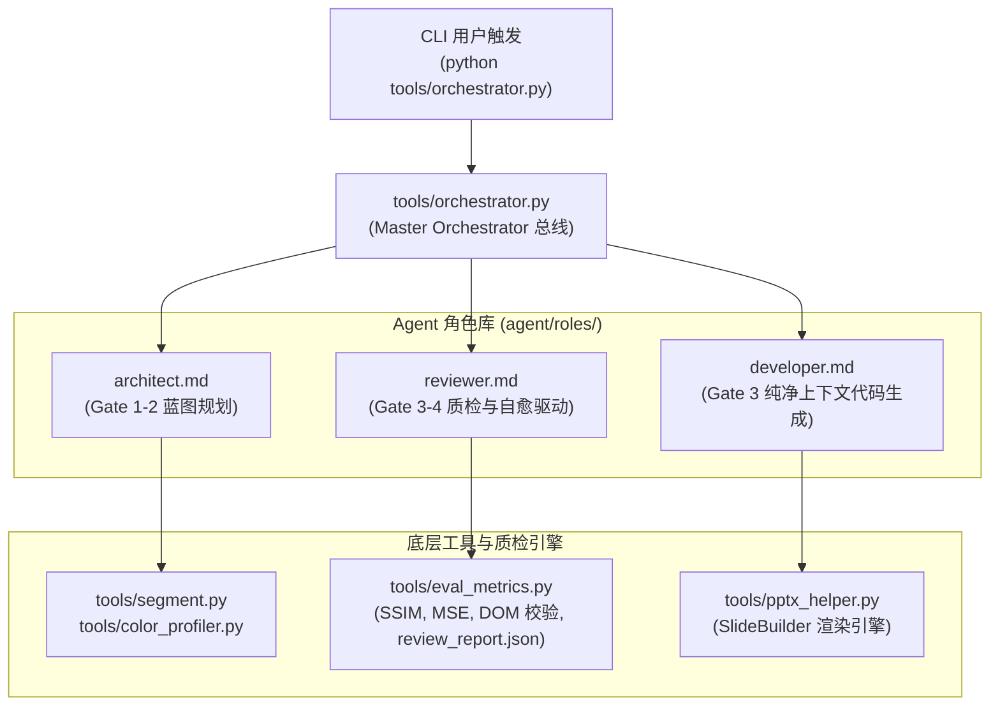

# 技术方案与架构设计说明书 (Plan)

## 🏗️ 1. 系统模块拓扑



---

## 📐 2. 核心数据结构与契约规范

### 2.1 `blueprint.json` 数据契约
```json
{
  "deck_name": "slide_02",
  "aspect_ratio": "16:9",
  "palette": { "primary": "#1E5AA0", "background": "#FFFFFF", "accent": "#C2410C" },
  "typography": { "title": 32.0, "section": 16.0, "body": 11.0, "badge": 8.5 },
  "blocks": [
    {
      "id": 1,
      "key": "header",
      "name": "Block 1 [Header]",
      "function_name": "add_header_section",
      "box": [35, 38, 930, 55],
      "components": ["title", "tag", "separator"]
    }
  ]
}
```

### 2.2 `eval_metrics.py` 自动化质检逻辑
- 图像相似度：利用 `PIL` / `math` 计算 SSIM（结构相似度指数，0.0~1.0）与 MSE。
- DOM 检查：解析目标 `.pptx` 文件的 XML 树，严格统计 `p:pic` 标签数量。
- 输出结构化报告：`review_report.json`。

### 2.3 `orchestrator.py` 状态机执行流
1. `init`：创建项目上下文与脚手架。
2. `plan`：生成 `blueprint.json` 并输出交互式蓝图透视图。
3. `build_block`：调度 Developer 编写单个 Block 代码并渲染。
4. `review_block`：调度 Reviewer 进行质检；若通过则推进下一 Block，若未通过则递增 `retry_count`（最大 3 次）。
5. `assemble`：全量组装输出最终 PPTX。

## 8. 变更记录
| 版本 | 变更类型 | 变更内容说明 | 评审人 |
| :--- | :--- | :--- | :--- |
| **2026-08-16** | 变更调优 | 单元测试同步校验 | Agent/Human |
| **2026-08-16** | 变更调优 | 单元测试同步校验 | Agent/Human |
