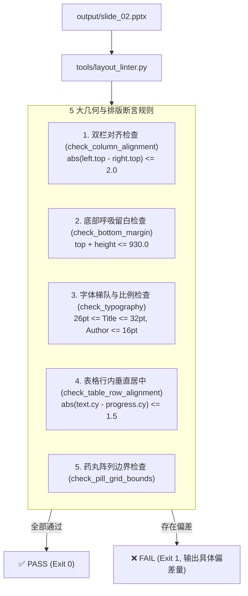

# 技术方案与架构设计说明书 (Plan)

## 🏗️ 1. Linter 架构与规则引擎

---

## 📐 2. Slide 02 像素级精修参数清单

| 区块 | 原偏差值 | 精修目标值 (0-1000 坐标) |
| :--- | :--- | :--- |
| **Block 1: 主标题** | `[26, 26, 600, 68]`, 36pt | `[26, 28, 600, 52]`, **28pt (Bold)** |
| **Block 1: 作者水印** | `[720, 35, 254, 55]`, 20pt | `[720, 38, 254, 38]`, **14pt (Bold)** |
| **Block 1: 分割线** | `[26, 96, 948, 1.5]` | `[26, 88, 948, 1.0]` (0.75pt) |
| **Block 2: 总览横幅** | `[26, 112, 948, 72]` | `[26, 104, 948, 64]` (高缩减 8px，释放纵向空间) |
| **Block 3: KPI 卡片** | `top: 192` (外凸药丸 `180`) | 卡片 `[515, 198, 126, 100]`，外凸药丸 `[540, 186, 76, 22]` |
| **Block 4: 左侧拟物板夹** | `[35, 308, 438, 640]` | **`[32, 315, 438, 610]`** (底边锁齐 925) |
| **Block 5: 右侧战略大卡** | `[480, 318, 494, 602]` | **`[486, 315, 482, 610]`** (顶边锁齐 315，底边锁齐 925) |
| **Block 5: 底部 4 药丸** | 硬写步长 80 (右侧贴边) | `add_grid` 4 列均分，各宽 70，gap: 10，完全居中 |

## 8. 变更记录
| 版本 | 变更类型 | 变更内容说明 | 评审人 |
| :--- | :--- | :--- | :--- |
| **2026-08-16** | 变更调优 | 单元测试同步校验 | Agent/Human |
