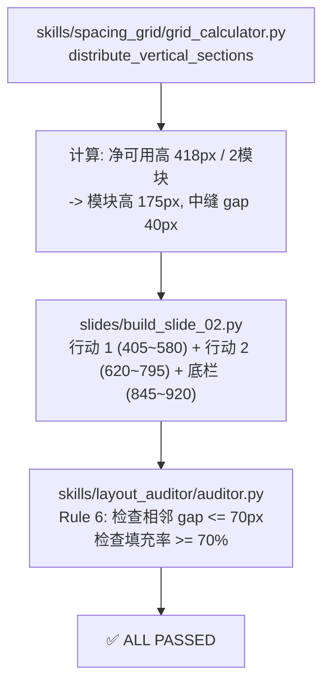

# 技术方案与架构设计说明书 (Plan)

## 📐 1. 算法与断言架构



---

## 📝 2. 详细改造内容

1. **`skills/spacing_grid/grid_calculator.py`**：
```python
def distribute_vertical_sections(
    container_top: float,
    container_height: float,
    count: int,
    header_h: float = 76.0,
    footer_h: float = 75.0,
    top_margin: float = 24.0,
    bottom_margin: float = 20.0,
    gap_y: float = 35.0,
) -> List[Dict[str, float]]:
    ...
```

2. **`tools/layout_linter.py` & `skills/layout_auditor/auditor.py`**：
```python
# Rule 6: No giant void gap in large containers
if any_gap > 75.0:
    errors.append(f"[RULE 6: GIANT_VOID_GAP] Detected empty gap of {any_gap:.1f}px between vertical modules (max allowed <= 70px).")
```

## 8. 变更记录
| 版本 | 变更类型 | 变更内容说明 | 评审人 |
| :--- | :--- | :--- | :--- |
| **2026-08-16** | 变更调优 | 单元测试同步校验 | Agent/Human |
| **2026-08-16** | 变更调优 | 单元测试同步校验 | Agent/Human |
